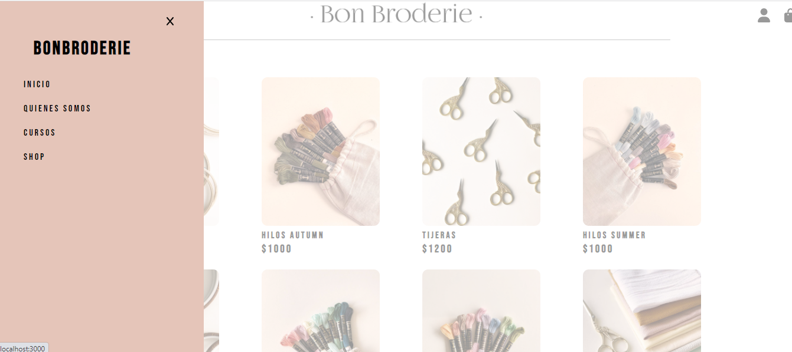

# Bonbroderie

Bonbroderie es un proyecto iniciado en el año 2021, consiste en la venta de materiales para bordados.
También se desea implementar una modalidad de cursos online.

## Prueba nuestro demo!

**DEMO** 
[Bonbroderie Site](http://bonbroderie.netlify.app)

## Usabilidad del sitio web.

Momentaneamente la pagina de inicio esta vinculada directamente al shop.
En el shop el usuario podrá visualizar nuestros productos organizados por categoría.

Al seleccionar un producto del listado se despliega el detalle del mismo. De esta forma el usuario puede seleccionar la cantidad que desee siempre y cuando haya stock del mismo.

A su vez el detalle trae consigo la posibilidad de ver otros productos de la misma categoría, para así poder navegar en el detalle de cada uno.

Si se desea volver al shop, en el menu hamburguesa el link Shop es el unico habilitado por el momento.

Una vez seleccionada la cantidad deseada del producto el contador se bloqueará y el usuario podrá:

* Continuar con la compra mediante el botón que aparecerá para tal fin.
* Continuar navengando entre los items pertenecientes a la misma categoría.
* Volver al shop para continuar la compra de otros productos.

Tambien es posible navegar al shop desde cualquier parte del sitio web mediante el CartWidget que se encuentra en la esquina superior derecha. Asímismo este mostrará, en caso de existir items en el carrito, la cantidad total de productos seleccionados.

En caso de acceder al carrito de compras, estando este vacío, nos mostrará un mensaje para volver al shop a seleccionar productos.

Al haber seleccionado productos, estos se mostrarán en el carrito de compras. Por medio de este el usuario podrá manipular las cantidades deseadas o incluso eliminar aquellos que no crea sean necesarios.

En el margen inferior se muestra la suma total que deberá abonar el usuario conforme los productos y las cantidades que haya seleccionado. Mediante el botón INICIAR COMPRA podrá realizar el pago de los productos.
En caso de concretarse dicho pago se le informará mediante un Alert y será redirigido al shop para seguir eligiendo productos si asi lo desease.

******
**NOTA:**
El sistema requiere que al momento de realizar la compra el usuario se encuentre identificado. En caso contrario se le solicitará identificarse, ya sea iniciando sesion con una cuenta existente o bien creando una nueva.
****

## Librerías y utilidades

* [SweetAlert](https://sweetalert2.github.io/recipe-gallery/sweetalert2-react.html "Link SweetAlert")
* [FontAwesome](https://fontawesome.com/ "Link FontAwesome")
* [Google Fonts](https://fonts.google.com/ "Link Google Fonts")
* [Firebase](https://firebase.google.com/products/firestore?gclid=CjwKCAjwi6WSBhA-EiwA6Niok7uNcjErA_kbiQ9whaoKua7WSBDyUdOMGS-l0SMWZFs6Dq-8--uaKxoCiBkQAvD_BwE&gclsrc=aw.ds "Link Firebase")

## Estado de la Implementación

La implementación del sitio no esta completa conforme los objetivos personales que propuse alcanzar. El estado de la implementación hasta el momento es la siguiente:

- [x] Estética desarrolada del sitio.
- [x] Shop con productos guardados en backend.
- [x] Carro de compras.
- [x] Implementado el formulario de usuarios guardar los datos de los mismos en el backend.
- [ ] Implementar MercadoPago como medio de pago.
- [ ] Completar las paginas para presentación, cursos y creación de usuarios.

[^1]: volver al inicio.

